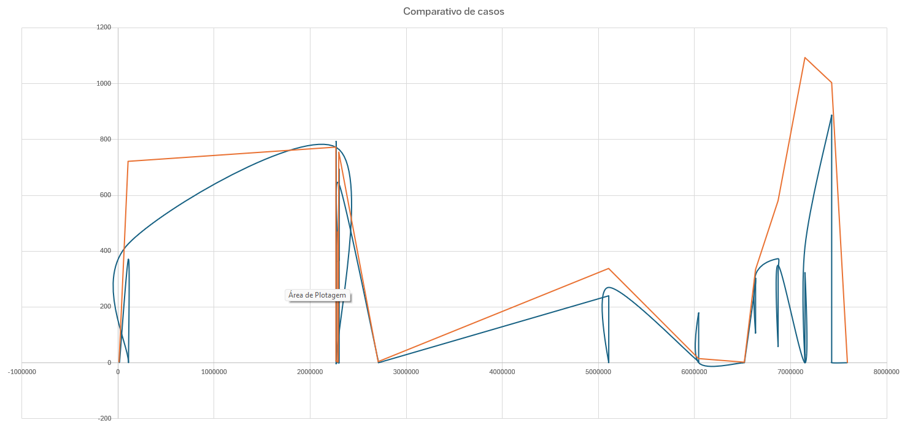

## Introdução

Esse foi um estudo baseado no repositório MCS criado pelo aluno de mestrado Ramon Garcia que visa estabelecer um modelo capaz de estimar casos de dengue com base em um conjunto de dados meteorológicos. Para isso, são usados dados de cinco instituições brasileiras.

CNES - Dados de unidades de saúde no Brasil

SINAN - Dados de casos de dengue no Brasil

INMET - Dados do tempo no Brasil

LST - Dados de temperatura do chão no Brasil

RRQPE - Dados de chuvas no Brasil

A utilidade do estudo é evidente, pois as prefeituras podem estabelecer diferentes protocolos em hospitais e postos de saúde caso certos aspectos de temperatura, chuva sejam observados. Ou podem realizar determinadas campanhas de limpeza ou conscientização de maneira mais efetiva.

Devido a problemas que eu tive com o processamento, e alguns dados estavam bloqueados por Tokens de API, eu não consegui baixar e processar os dados seguindo o que foi fornecido no GIT, portanto, precisei pegar esses dados diretamente do Ramon.

## Comparativo de modelos

Analisando o código de construção do dataset, podemos ver que ele é feito com base nas IDs de unidade do sinan, os casos são de 2019 a 2023.

Cada ID é analisado de quatro maneiras diferentes

all_features = com todas as features de clima (chuva, temperatura e tempo)

inmet = análise somente com o inmet

sat = análise somente com o sat

no_climate_features = nenhuma feature de tempo analisada 

sinan_df = sinan_df[sinan_df['ID_UNIDADE'].isin([
                        '7427549',
                        '2268922',
                        '7149328',
                        '2299216',
                        '0106453',
                        '6870066',
                        '6042619',
                        '2288893',
                        '5106702',
                        '6635148',
                        '2269481',
                        '2708353',
                        '7591136',
                        '2283395',
                        '2287579',
                        '2291533',
                        '2292386',
                        '0012505',
                        '2292084',
                        '6518893'])]

## Keras

O código original foi escrito usando keras para fazer um modelo de LSTM.

Aqui nós podemos ver como os casos se comportam versus os resultados obtidos pelos modelos:

No eixo X temos os códigos de ID, e no eixo Y temos os casos totais, podemos ver como o modelo se comportou.

No final do treinamento obtemos um CSV e uma série de gráficos que demonstram os resultados do treinamento. Nesse CSV podemos analisar o comportamento do modelo, e formular uma conclusão:

- Com poucos casos de dengue para treino e estimativa, o modelo não consegue fazer uma estimativa de boa qualidade

- O modelo se comporta melhor com mais casos de dengue para treinar e estimar

- Analisando os gráficos, a análise com piores resultados foi a de isolar inmet_features e sat_features, tendo os maiores MSEs. E um outro problema, no_climate_features embora acerte consideravelmente em certas áreas, vendo os gráficos e resultados da tabela, a realidade é que isso se trata de um caso de overfitting. Isso fica bem visível aqui:

	

Portanto, usar as features de clima se apresenta como a melhor abordagem.

## Pytorch

Agora para as modificações feitas usando o pytorch, ambos vão usar o LSTM

O comportamento do modelo:

O pytorch teve resultados melhores, e com base na pesquisa que eu fiz, isso era esperado. Entretanto, o pytorch possui um grau de complexidade maior de aplicação, menor legibilidade e poderia ser mais difícil para continuar o projeto.

- Os comportamentos relativos à quantidade de exemplos são diferentes entre keras e pytorch, pytorch foi capaz de acertar com menos exemplos, algo que não foi possível no keras. Vale ressaltar que o conjunto de treino deve ter um valor próximo de uma estimativa, então trabalhar com conjuntos de treinos pequenos não é o ideal.

- No pytorch temos uma visão mais clara de qual é o método de análise menos eficiente, o sat_features, mas a questão de overfitting possivelmente está ocorrendo de novo.

- Sendo assim, a análise com base nas features de clima potencialmente oferece um resultado mais realista e balanceado.

## Drive com dados coletados:

https://drive.google.com/drive/folders/1e3zeKsxuHYebvFtvQlt4CLvunRGld3Zf?usp=drive_link

